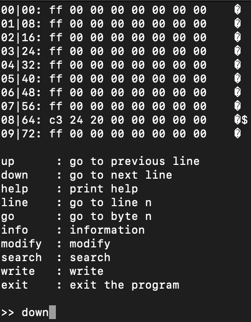

# hexacli

## Introduction

Small CLI hexadecimal editor to open binary files. 

This is a small project to discover Rust programming.

Work in progress...

## TODO

- Implement modify function
- Implement search function
- Implement write function
- Make a WASM version
